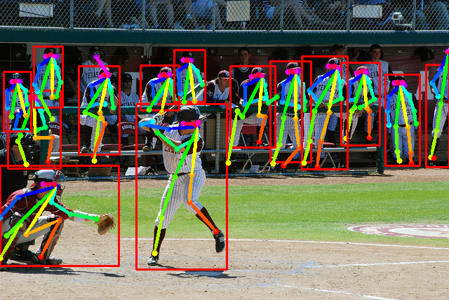

### Introduction

This is a pytorch implementation of [MultiPoseNet](https://arxiv.org/abs/1807.04067) ( ECCV 2018, Muhammed Kocabas et al.)



[](https://opensource.org/licenses/MIT) 

### Contents

0. [**Update**](#update)

1. [Requirements](#requirements)
2. [Training](#training)
3. [Validation](#validation)
4. [Demo](#demo)
5. [Result](#result)
6. [Acknowledgements](#acknowledgements)
7. [Citation](#citation)

### Demo

Run inference on your own pictures.

- Prepare checkpoint:
  - Download our baseline model ([Google Drive](https://drive.google.com/open?id=1Y38q5mIY2XL7mmdaBrF06beYcZZO6v2Z),  [Tsinghua Cloud](https://cloud.tsinghua.edu.cn/f/8b7f780fe1df46febe73/), backbone: resnet101) or use your own model.
  - Specify the checkpoints file path `params.ckpt` in file `multipose_test.py`. 
  - Specify the pictures file path `testdata_dir`  and results file path `testresult_dir` in file `multipose_test.py`. 

- Run:
```python
python ./evaluate/multipose_test.py  # inference on your own pictures
python ./evaluate/multipose_coco_eval.py  # COCO evaluation
```

### Result

- mAP (baseline checkpoint, temporarily)

```
 Average Precision  (AP) @[ IoU=0.50:0.95 | area=   all | maxDets= 20 ] = 0.590
 Average Precision  (AP) @[ IoU=0.50      | area=   all | maxDets= 20 ] = 0.791
 Average Precision  (AP) @[ IoU=0.75      | area=   all | maxDets= 20 ] = 0.644
 Average Precision  (AP) @[ IoU=0.50:0.95 | area=medium | maxDets= 20 ] = 0.565
 Average Precision  (AP) @[ IoU=0.50:0.95 | area= large | maxDets= 20 ] = 0.636
 Average Recall     (AR) @[ IoU=0.50:0.95 | area=   all | maxDets= 20 ] = 0.644
 Average Recall     (AR) @[ IoU=0.50      | area=   all | maxDets= 20 ] = 0.810
 Average Recall     (AR) @[ IoU=0.75      | area=   all | maxDets= 20 ] = 0.689
 Average Recall     (AR) @[ IoU=0.50:0.95 | area=medium | maxDets= 20 ] = 0.601
 Average Recall     (AR) @[ IoU=0.50:0.95 | area= large | maxDets= 20 ] = 0.709
```

### Requirements

#### Prerequisites
- **Disable cudnn for batch_norm**: (See: [@Microsoft / human-pose-estimation.pytorch#installation](https://github.com/Microsoft/human-pose-estimation.pytorch#installation))

```bash
# PYTORCH=/path/to/pytorch
# for pytorch v0.4.0
sed -i "1194s/torch\.backends\.cudnn\.enabled/False/g" ${PYTORCH}/torch/nn/functional.py
# for pytorch v0.4.1
sed -i "1254s/torch\.backends\.cudnn\.enabled/False/g" ${PYTORCH}/torch/nn/functional.py

# Note that instructions like # PYTORCH=/path/to/pytorch indicate that you should pick 
# a path where you'd like to have pytorch installed and then set an environment
# variable (PYTORCH in this case) accordingly.
```

- If you are using Anaconda, we suggest you create a new conda environment :`conda env create -f multipose_environment.yaml`. Maybe you should change the `channels:` and `prefix:` setting in `multipose_environment.yaml` to fit your own Anaconda environment.
  - `source activate Multipose`
  - `pip install pycocotools`

- You can also follow `dependencies` setting in `multipose_environment.yaml` to build your own Python environment.
  - Pytorch = 0.4.0, Python = 3.6
  - pycocotools=2.0.0, numpy=1.14.3, scikit-image=0.13.1, opencv=3.4.2
  - ......

- Build the NMS extension
```bash
  cd ./lib
  bash build.sh
  cd ..
```

#### Data preparation

**You can skip this step if you just want to run inference on your own pictures using our baseline checkpoint**

- For Training Keypoint Estimation Subnet, we followed [ZheC/Realtime_Multi-Person_Pose_Estimation](https://github.com/ZheC/Realtime_Multi-Person_Pose_Estimation)'s first 4 Training Steps prepared our COCO2014 dataset (train2014, val2014 and mask2014). 
- We also use COCO2017 dataset to train Person Detection Subnet.

Make them look like this:

```bash
${COCO_ROOT}
   --annotations
      --instances_train2017.json
      --instances_val2017.json
      --person_keypoints_train2017.json
      --person_keypoints_val2017.json
   --images
      --train2014
      --val2014
      --train2017
      --val2017
   --mask2014
   --COCO.json
```

### Training

- Prepare
  - Change the hyper-parameter `coco_root` to your own COCO path.
  - You can change the parameter `params.gpus` to define which GPU device you want to use, such as `params.gpus = [0,1,2,3]`. 
  - The trained model will be saved in  `params.save_dir`  folder every epoch.
- Run:
```python
python ./training/multipose_keypoint_train.py  # train keypoint subnet
python ./training/multipose_detection_train.py  # train detection subnet
python ./training/multipose_prn_train.py  # train PRN subnet
```

### Validation

- Prepare checkpoint:
  - Download our baseline model ([Google Drive](https://drive.google.com/open?id=1Y38q5mIY2XL7mmdaBrF06beYcZZO6v2Z),  [Tsinghua Cloud](https://cloud.tsinghua.edu.cn/f/8b7f780fe1df46febe73/), backbone: resnet101) or use your own model.
  - Specify the checkpoints file path `params.ckpt` in file `multipose_*_val.py`. 

- Run:
```python
python ./evaluate/multipose_keypoint_val.py  # validate keypoint subnet on first 2644 of val2014 marked by 'isValidation = 1', as our minval dataset.
python ./evaluate/multipose_detection_val.py  # validate detection subnet on val2017
python ./evaluate/multipose_prn_val.py  # validate PRN subnet on val2017
```

### To Do

- [x] Keypoint Estimation Subnet for 17 human keypoints annotated in [COCO dataset](http://cocodataset.org/)
- [x] Keypoint Estimation Subnet with intermediate supervision
- [x] Combine Keypoint Estimation Subnet with Person Detection Subnet(RetinaNet)
- [x] Combine Keypoint Estimation Subnet with [Pose Residual Network](https://github.com/salihkaragoz/pose-residual-network-pytorch/tree/master)
- [ ] Keypoint Estimation Subnet with person segmentation mask

### Update

- 180925:
  - Add Person Detection Subnet (RetinaNet) in `posenet.py`.
  - Add NMS extension in `./lib`.

- 180930:
  - Add the training code `multipose_detection_train.py` for RetinaNet.  
  - Add `multipose_keypoint_*.py` and `multipose_detection_*.py` for Keypoint Estimation Subnet and Person Detection Subnet respectively. Remove `multipose_resnet_*.py`.

- 1801003:
  - Add the training code `multipose_prn_train.py` for PRN.  
  - Add `multipose_coco_eval.py` for COCO evaluation.

- 181115:
  - New dataloader for detection subnet, remove `RetinaNet_data_pipeline.py`
  - Add intermediate supervision in Keypoint Estimation Subnet
  - Enable batch_norm for Keypoint Estimation Subnet. 
  - New prerequisites: [Disable cudnn for batch_norm](https://github.com/LiMeng95/MultiPoseNet.pytorch#prerequisites)
  - New checkpoint ([Google Drive](https://drive.google.com/open?id=1Y38q5mIY2XL7mmdaBrF06beYcZZO6v2Z),  [Tsinghua Cloud](https://cloud.tsinghua.edu.cn/f/8b7f780fe1df46febe73/), backbone: resnet101)

### Acknowledgements

- [@ZheC Realtime_Multi-Person_Pose_Estimation](https://github.com/ZheC/Realtime_Multi-Person_Pose_Estimation) : The first 4 Training Steps to generate our own COCO dataset.
- Thanks [@IcewineChen](https://github.com/IcewineChen/pytorch-MultiPoseNet) for the implement of `posenet`.
- Thanks [@yhenon](https://github.com/yhenon/pytorch-retinanet) for the implement of RetinaNet in PyTorch.
- [@Microsoft / human-pose-estimation.pytorch#installation](https://github.com/Microsoft/human-pose-estimation.pytorch#installation) :Disable cudnn for batch_norm
