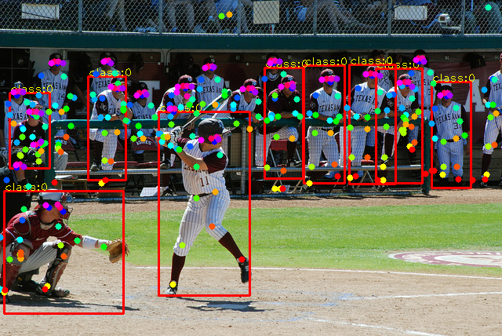

### Introduction

This is a pytorch implementation of [MultiPoseNet](https://arxiv.org/abs/1807.04067) ( ECCV 2018, Muhammed Kocabas et al.)



### To Do

- [x] Keypoint Estimation Subnet for 17 human keypoints annotated in [COCO dataset](http://cocodataset.org/)
- [ ] Keypoint Estimation Subnet with person segmentation mask and intermediate supervision
- [x] Combine Keypoint Estimation Subnet with Person Detection Subnet(RetinaNet)
- [ ] Combine Keypoint Estimation Subnet with [Pose Residual Network](https://github.com/salihkaragoz/pose-residual-network-pytorch/tree/master)

### Update

- 180925:
  - Add Person Detection Subnet (RetinaNet) in `posenet.py`.
  - Add NMS extension in `./lib`.
- 180930:
  - Add the training code `multipose_detection_train.py` for RetinaNet.  
  - New checkpoint ([Google Drive](https://drive.google.com/file/d/1bW6dH3_fn1_N6UFk79OIkKtW_smdeVpL/view?usp=sharing),  [Tsinghua Cloud](https://cloud.tsinghua.edu.cn/f/7328ce2cb7bd4f558a78/), backbone: resnet101)
  - Add `multipose_keypoint_*.py` and `multipose_detection_*.py` for Keypoint Estimation Subnet and Person Detection Subnet respectively. Remove `multipose_resnet_*.py`.

### Contents

1. [Requirements](#requirements)
2. [Training](#training)
3. [Validation](#validation)
4. [Inference](#inference)
5. [Result](#result)
6. [Acknowledgements](#acknowledgements)
7. [Citation](#citation)

### Requirements

#### Prerequisites
- If you are using Anaconda, we suggest you create a new conda environment :`conda env create -f multipose_environment.yaml`. Maybe you should change the `channels:` and `prefix:` setting in `multipose_environment.yaml` to fit your own Anaconda environment.
  - `source activate Multipose`
  - `pip install pycocotools`

- You can also follow `dependencies` setting in `multipose_environment.yaml` to build your own Python environment.
  - Pytorch = 0.4.0, Python = 3.6
  - pycocotools=2.0.0, numpy=1.14.3, scikit-image=0.13.1, opencv=3.4.2
  - ......

- Build the NMS extension
```bash
  cd ./lib
  bash build.sh
  cd ..
```

#### Data preparation

**You can skip this step if you just want to run inference on your own pictures using our baseline checkpoint**

- For Training Keypoint Estimation Subnet, we followed [ZheC/Realtime_Multi-Person_Pose_Estimation](https://github.com/ZheC/Realtime_Multi-Person_Pose_Estimation)'s first 4 Training Steps prepared our COCO2014 dataset (train2014, val2014 and mask2014). 
- We also use COCO2017 dataset to train Person Detection Subnet.

Make them look like this:

```bash
${COCO_ROOT}
   --annotations
      --instances_train2017.json
      --instances_val2017.json
   --images
      --train2014
      --val2014
      --train2017
      --val2017
   --mask2014
   --COCO.json
```

### Training

- Prepare
  - Change the hyper-parameter `coco_root` to your own COCO path.
  - You can change the parameter `params.gpus` to define which GPU device you want to use, such as `params.gpus = [0,1,2,3]`. 
  - The trained model will be saved in  `params.save_dir`  folder every epoch.
- Run:
```python
python multipose_keypoint_train.py  # train keypoint subnet
python multipose_detection_train.py  # train detection subnet
```

### Validation

- Prepare checkpoint:
  - Download our baseline model ([Google Drive](https://drive.google.com/file/d/1bW6dH3_fn1_N6UFk79OIkKtW_smdeVpL/view?usp=sharing),  [Tsinghua Cloud](https://cloud.tsinghua.edu.cn/f/7328ce2cb7bd4f558a78/), backbone: resnet101) or use your own model.
  - Specify the checkpoints file path `params.ckpt` in file `multipose_resnet_val.py`. 

- Run:
```python
python multipose_keypoint_val.py  # validate keypoint subnet on first 2644 of val2014 marked by 'isValidation = 1', as our minval dataset.
python multipose_detection_val.py  # validate detection subnet on val2017
```

### Inference

Run inference on your own pictures.

- Prepare checkpoint:
  - Download our baseline model ([Google Drive](https://drive.google.com/file/d/1bW6dH3_fn1_N6UFk79OIkKtW_smdeVpL/view?usp=sharing),  [Tsinghua Cloud](https://cloud.tsinghua.edu.cn/f/7328ce2cb7bd4f558a78/), backbone: resnet101) or use your own model.
  - Specify the checkpoints file path `params.ckpt` in file `multipose_resnet_test.py`. 
  - Specify the pictures file path `testdata_dir`  and results file path `testresult_dir` in file `multipose_resnet_val.py`. 

- Run:
```python
python multipose_test.py
```

### Result

- Validation loss

| keypoint mean |  keypoint std  | detection mean |  subnet std  |
| :------:   | :----:   |:------:   | :----:   |
| 0.00055 |0.00033|1.09604 |0.37352|

- Inference results

<center class="half">

</center>


### Acknowledgements

- [@ZheC Realtime_Multi-Person_Pose_Estimation](https://github.com/ZheC/Realtime_Multi-Person_Pose_Estimation) : The first 4 Training Steps to generate our own COCO dataset.
- Thanks [@IcewineChen](https://github.com/IcewineChen/pytorch-MultiPoseNet) for the implement of `posenet`.
- Thanks [@yhenon](https://github.com/yhenon/pytorch-retinanet) for the implement of RetinaNet in PyTorch.

### Citation
```
@Inproceedings{kocabas18prn,
  Title          = {Multi{P}ose{N}et: Fast Multi-Person Pose Estimation using Pose Residual Network},
  Author         = {Kocabas, Muhammed and Karagoz, Salih and Akbas, Emre},
  Booktitle      = {European Conference on Computer Vision (ECCV)},
  Year           = {2018}
}
```