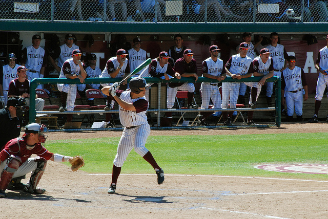
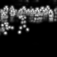
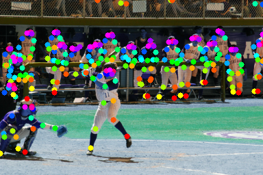
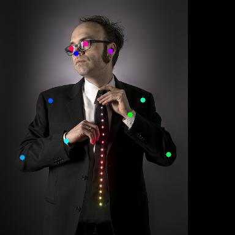

### Introduction

This is a pytorch implementation of [MultiPoseNet](https://arxiv.org/abs/1807.04067) ( ECCV 2018, Muhammed Kocabas et al.)

<center class="third">

</center>

### To Do

- [x] Keypoint Estimation Subnet for 17 human keypoints annotated in [COCO dataset](http://cocodataset.org/)
- [ ] Keypoint Estimation Subnet with person segmentation mask and intermediate supervision
- [ ] Combine Keypoint Estimation Subnet with Person Detection Subnet(RetinaNet)
- [ ] Combine Keypoint Estimation Subnet with [Pose Residual Network](https://github.com/salihkaragoz/pose-residual-network-pytorch/tree/master)

### Requirements

#### Prerequisites
- If you are using Anaconda, we suggest you create a new conda environment :`conda env create -f multipose_environment.yaml`. Maybe you should change the `channels:` and `prefix:` setting in `multipose_environment.yaml` to fit your own Anaconda environment.
  - `source activate Multipose`
  - `pip install pycocotools`
- You can also follow `dependencies` setting in `multipose_environment.yaml` to build your own Python environment.
  - Pytorch = 0.4.0, Python = 3.6
  - pycocotools=2.0.0, numpy=1.14.3, scikit-image=0.13.1, opencv=3.4.2
  - ......

#### Data preparation

We followed [ZheC/Realtime_Multi-Person_Pose_Estimation](https://github.com/ZheC/Realtime_Multi-Person_Pose_Estimation)'s first 4 Training Steps prepared our COCO2014 dataset (train2014, val2014 and mask2014), and make them look like this:

```
${COCO_ROOT}
   --images
      --train2014
      --val2014
   --mask2014
   --COCO.json
```

### Train

Train on all training data (82783+40504-2644 = 120643 samples)

- Run:
  ```python
  python multipose_resnet_train.py
  ```

  - Change the Hyper-parameter `coco_root` to your own COCO path.
  - The trained model will be saved in  `params.save_dir`  folder every epoch.
  - You can change the parameter `params.gpus` to define which GPU device you want to use, such as `params.gpus = [0,1,2,3]`. 

### Validation

Run validation on first 2644 of val2014 marked by 'isValidation = 1', as our minval dataset.

- Prepare checkpoint:
  - Download our baseline model ([Google Drive](https://drive.google.com/file/d/1na9N9HtK9z5TXnRtlIjwku1yHdcdIGS3/view?usp=sharing), [Tsinghua Cloud](https://cloud.tsinghua.edu.cn/f/b391609440d44a90a381/)) or use your own model.
  - Specify the checkpoints file path `params.ckpt` in file `multipose_resnet_val.py`. 

- Run:
  ```python
  python multipose_resnet_val.py
  ```
  
### Inference

Run inference on your own pictures.

- Prepare checkpoint:
  - Download our baseline model ([Google Drive](https://drive.google.com/file/d/1na9N9HtK9z5TXnRtlIjwku1yHdcdIGS3/view?usp=sharing), [Tsinghua Cloud](https://cloud.tsinghua.edu.cn/f/b391609440d44a90a381/)) or use your own model.
  - Specify the checkpoints file path `params.ckpt` in file `multipose_resnet_test.py`. 
  - Specify the pictures file path `testdata_dir`  and results file path `testresult_dir` in file `multipose_resnet_val.py`. 

- Run:
  ```python
  python multipose_resnet_test.py
  ```

### Result

- Validation loss

| mean |  std  |
| :------:   | :----:   |
| 0.0007737 |0.0004432|

- Inference results

<center class="third">

</center>

<center class="third">

</center>

### Reference

- [@ZheC Realtime_Multi-Person_Pose_Estimation](https://github.com/ZheC/Realtime_Multi-Person_Pose_Estimation) : The first 4 Training Steps to generate our own COCO dataset.
- Thanks [@IcewineChen](https://github.com/IcewineChen/pytorch-MultiPoseNet) for the implement of `posenet`.

### Citation
```
@Inproceedings{kocabas18prn,
  Title          = {Multi{P}ose{N}et: Fast Multi-Person Pose Estimation using Pose Residual Network},
  Author         = {Kocabas, Muhammed and Karagoz, Salih and Akbas, Emre},
  Booktitle      = {European Conference on Computer Vision (ECCV)},
  Year           = {2018}
}
```